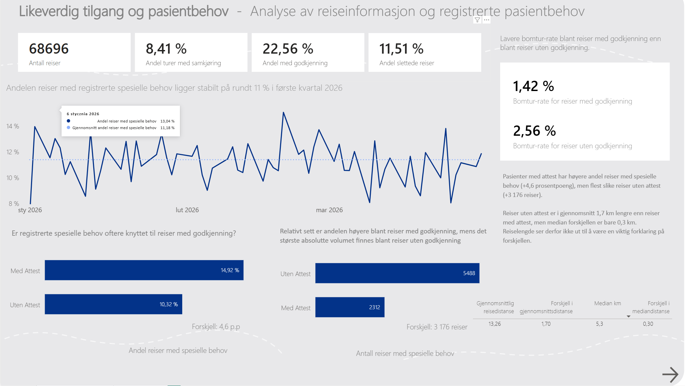
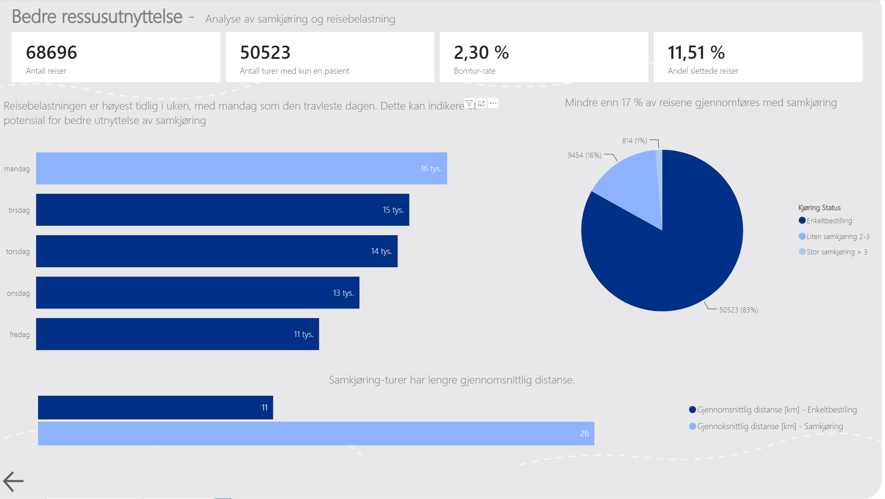

# Analyse av pasienttransport – Power BI-case

## Om prosjektet

Dette prosjektet viser en Power BI-analyse av anonymiserte data om pasienttransport.

Formålet med analysen var å undersøke hvordan transportressursene brukes, samtidig som jeg så nærmere på likeverdig tilgang, registrerte pasientbehov og muligheter for bedre samkjøring.

Organisasjonsnavn og annen identifiserende informasjon er fjernet. 

## Problemstillinger

Analysen tar utgangspunkt i blant annet følgende spørsmål:

- Hvor stor andel av reisene gjennomføres med samkjøring?
- Når i uken er reisebelastningen høyest?
- Har samkjørte reiser lengre gjennomsnittlig reisedistanse?
- Hvor stor andel av reisene blir slettet eller registrert som bomtur?
- Er registrerte spesielle behov ulikt fordelt mellom ulike grupper av reiser?
- Finnes det mønstre som kan indikere muligheter for bedre ressursutnyttelse?

## Datamodell

Rapporten er bygget på en relasjonell datamodell som kobler informasjon om reiser, bestillinger, pasientbehov og andre relevante dimensjoner. Modellen er anonymisert for porteføljebruk.

## Viktige KPI-er

Rapporten inneholder blant annet:

- Antall reiser
- Andel samkjørte reiser
- Antall enkeltreiser
- Andel slettede reiser
- Bomtur-rate
- Andel reiser med registrerte spesielle behov
- Gjennomsnittlig reisedistanse
- Forskjeller mellom ulike grupper av reiser

## Likeverdig tilgang og pasientbehov

Denne delen av analysen undersøker om registrerte spesielle behov forekommer ulikt mellom ulike grupper av reiser.

Det er viktig å skille mellom relativ andel og absolutt volum. En gruppe kan ha en høyere andel reiser med registrerte spesielle behov, samtidig som en annen gruppe står for det største antallet slike reiser totalt.

Reisedistanse ble også analysert for å undersøke om den kunne bidra til å forklare forskjellene.

## Bedre ressursutnyttelse

Den andre delen av rapporten fokuserer på samkjøring og reisebelastning.

Reisevolumet ble sammenlignet mellom ukedagene for å identifisere perioder med høy belastning.

Analysen viser også fordelingen mellom enkeltreiser og samkjørte reiser, samt forskjeller i gjennomsnittlig reisedistanse. Dette kan brukes som grunnlag for å identifisere områder hvor bedre samkjøring potensielt kan gi mer effektiv ressursutnyttelse.

## Hovedfunn

- Samkjøring utgjør en relativt liten del av reisene, noe som indikerer et mulig potensial for bedre ressursutnyttelse.
- Reisebelastningen varierer gjennom uken og er høyest tidlig i uken.
- Reiser med registrerte spesielle behov viser ulike mønstre mellom gruppene når relativ andel sammenlignes med absolutt volum.
- Reisedistanse alene ser ikke ut til å forklare forskjellene mellom gruppene.

## Verktøy

- Power BI
- Power Query
- DAX
- Datamodellering
- Datavisualisering

## Kompetanse som vises i prosjektet

- Datavask og transformasjon
- Datamodellering
- Utvikling av KPI-er
- DAX-beregninger
- Utforskende dataanalyse
- Visualisering og dashboard-design
- Analyse av relative og absolutte forskjeller
- Oversettelse av datafunn til operasjonelle problemstillinger

## Personvern og data
Organisasjonsnavn, identifiserende informasjon og sensitiv kontekst er fjernet.
## Rapport

### Likeverdig tilgang og pasientbehov

### Bedre ressursutnyttelse

## Merknad

Prosjektet presenteres som et selvstendig portefølje-case og skal ikke tolkes som en offisiell analyse eller publikasjon fra organisasjonen som det opprinnelige analysematerialet var knyttet til.
